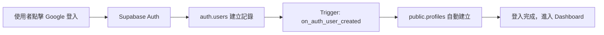

# ✅ Migration 錯誤已修復！

## 📋 問題摘要

**原始錯誤**：
```
ERROR: insert or update on table "profiles" violates foreign key constraint "profiles_user_id_fkey"
Key (user_id)=(00000000-0000-0000-0000-000000000001) is not present in table "users".
```

**原因**：
- `001_init_complete_schema.sql` 中的測試資料嘗試插入記錄，但對應的 `auth.users` 不存在
- 測試資料的 `user_id` 指向不存在的使用者 UUID
- SQL 註解語法不完整，導致部分測試資料仍然執行

---

## 🔧 修復內容

### 1. 註解掉所有測試資料

**檔案**：`supabase/migrations/001_init_complete_schema.sql`

```sql
-- 第九部分：測試資料（已註解，避免 FK 錯誤）
-- 
-- 注意：測試資料需要先在 auth.users 中建立對應的使用者
-- 建議：在應用程式中透過 Google OAuth 登入後，自動建立 profile

/*
-- 測試使用者 Profile
INSERT INTO public.profiles (user_id, username, display_name, bio, created_at)
VALUES (
  '00000000-0000-0000-0000-000000000001'::uuid,
  'demo_user',
  '示範使用者',
  '戶外探險愛好者',
  now()
)
ON CONFLICT (user_id) DO NOTHING;

-- 測試旅程 (已註解)
-- 測試裝備 (已註解)
*/
```

**影響**：
- ✅ Profiles 測試資料已註解
- ✅ Trips 測試資料已註解
- ✅ Gear 測試資料已註解
- ✅ TripGear 關聯已註解

---

### 2. 修正 `002_fix_profiles_primary_key.sql`

**問題**：包含互動式 psql 命令 `\d public.profiles;`

**修正**：將驗證命令改為註解

```sql
-- ============================================
-- 驗證修改（已註解，這些是互動式命令）
-- ============================================
-- 
-- 如需驗證，請手動執行以下命令：
-- 
-- 1. 查看新的表結構：
--    \d public.profiles;
```

---

### 3. 刪除重複的 Migration 檔案

**刪除**：`supabase/migrations/00_init_complete_schema.sql`

**原因**：與 `001_init_complete_schema.sql` 重複，保留編號正確的版本

---

## ✅ 驗證結果

### Migration 成功執行

```bash
$ npx supabase db reset
Resetting local database...
Recreating database...
Initialising schema...
Seeding globals from roles.sql...
Applying migration 001_init_complete_schema.sql...
Applying migration 002_fix_profiles_primary_key.sql...
Finished supabase db reset on branch main.
```

### Prisma Client 重新生成

```bash
$ npx prisma generate
✔ Generated Prisma Client (v6.17.1) to ./node_modules/@prisma/client in 63ms
```

### Prisma Studio 已重啟

```
🔗 http://localhost:5555
```

---

## 📊 資料庫狀態

### 當前資料表（全部為空）

| 表名 | 說明 | 狀態 |
|------|------|------|
| `public.profiles` | 使用者個人資料 | ✅ 已建立（空表） |
| `public.trip` | 戶外旅程記錄 | ✅ 已建立（空表） |
| `public.gear` | 戶外裝備 | ✅ 已建立（空表） |
| `public.trip_gear` | 旅程-裝備關聯表 | ✅ 已建立（空表） |
| `auth.users` | Supabase Auth 使用者 | ✅ 已建立（空表） |

### Trigger 已建立

- ✅ `on_auth_user_created`：當新使用者註冊時，自動在 `public.profiles` 建立記錄

---

## 🚀 接下來的步驟

### 1. 測試 Google OAuth 登入

```bash
# 確保 dev server 正在執行
npm run dev
```

1. 開啟 http://localhost:3000
2. 點擊 Google 登入
3. 登入後，trigger 會自動建立 profile

### 2. 查看資料（使用 Prisma Studio）

```bash
# 已自動啟動，開啟瀏覽器
http://localhost:5555
```

**應該可以看到**：
- Profile 表（點擊後可以看到您的 Google 登入資料）
- Trip 表（空的，等待您建立）
- Gear 表（空的，等待您建立）
- TripGear 表（空的）

### 3. 或使用 Supabase Studio

```bash
http://127.0.0.1:54323
```

**優點**：
- 可以查看 `auth.users` 表
- 可以執行 SQL
- 完整的 Supabase 功能

---

## 🎯 資料流程說明

### 首次登入流程



### 資料查詢流程


---

## 📝 注意事項

### 關於測試資料

- ❌ **不建議**啟用 migration 中的測試資料
- ✅ **建議**：透過應用程式登入後，手動建立資料

### 如果需要快速測試資料

可以登入後，在 Prisma Studio 中手動建立：

1. 開啟 http://localhost:5555
2. 點擊 "Trip" → "Add record"
3. 填入資料並儲存
4. 同樣方式建立 Gear

### 重置資料庫

如需重新開始：

```bash
npx supabase db reset
```

這會：
1. 刪除所有資料
2. 重新執行所有 migrations
3. 建立空的資料表

---

## 🎉 總結

| 項目 | 狀態 |
|------|------|
| Migration 執行 | ✅ 成功 |
| 資料表建立 | ✅ 完成 |
| Trigger 建立 | ✅ 完成 |
| Prisma Client | ✅ 已生成 |
| Prisma Studio | ✅ 運行中 |
| 測試資料問題 | ✅ 已解決 |

**現在您可以**：
1. ✅ 使用 Google OAuth 登入
2. ✅ 自動建立 profile
3. ✅ 在 Prisma Studio 查看資料
4. ✅ 在應用程式中建立 trips 和 gear

---

## 📚 相關文件

- [Prisma Studio 使用指南](http://localhost:5555)
- [Supabase Studio](http://127.0.0.1:54323)
- [開發指南](./openspec/changes/refactor-supabase-to-prisma/tasks.md)

---

**日期**：2024-01-XX  
**狀態**：✅ 已解決  
**下一步**：測試 Google OAuth 登入

