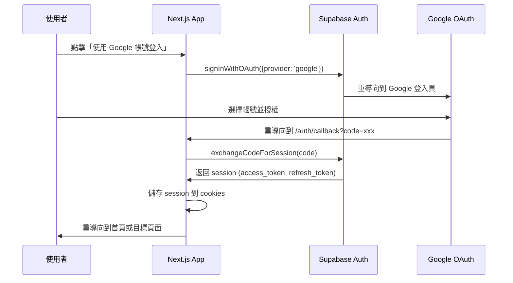
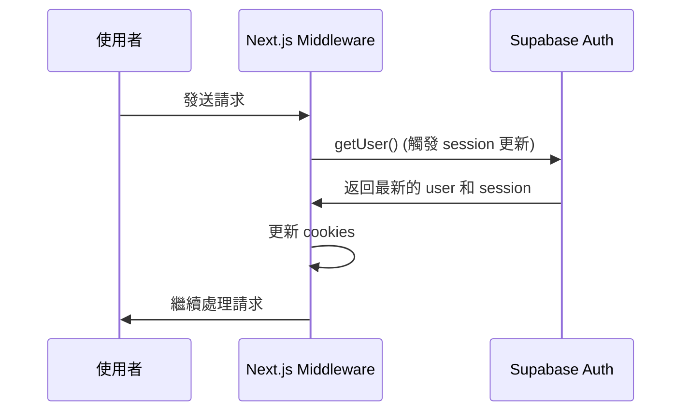

# 📋 Google 登入實作總結

## 🎯 實作概述

本次實作為 **Outdoor Trails Hub** 專案添加了完整的 Google OAuth 登入功能，使用 **Supabase Auth** 作為認證服務提供者。

---

## 📦 已建立的檔案

### 1. 核心認證邏輯

#### `lib/supabase/client.ts` (已更新)
- **用途**: 客戶端 Supabase 實例
- **使用場景**: Client Components 中的資料操作和認證
- **特點**: 
  - 使用 `createBrowserClient` 
  - 自動處理瀏覽器端的 session 管理
  - 提供 TypeScript 型別安全

#### `lib/supabase/server.ts` (新增)
- **用途**: 伺服器端 Supabase 實例
- **使用場景**: Server Components、Server Actions、Route Handlers
- **特點**:
  - 使用 `createServerClient`
  - 自動讀寫 cookies
  - 支援 Next.js 13+ App Router

#### `lib/supabase/middleware.ts` (新增)
- **用途**: Middleware 中的 Supabase 實例
- **使用場景**: 在每個請求前更新 session
- **特點**:
  - 確保 session 保持最新
  - 自動處理 token refresh
  - 防止認證狀態過期

---

### 2. 路由與頁面

#### `middleware.ts` (新增)
- **用途**: Next.js Middleware
- **功能**: 
  - 在每個請求前自動更新使用者 session
  - 確保 cookies 中的認證資訊保持最新
- **路由範圍**: 除了靜態資源外的所有路由

#### `app/page.tsx` (已更新)
- **用途**: 首頁 / 登入頁
- **更新內容**:
  - 添加 `handleGoogleSignIn` 函數
  - 整合 Google OAuth 登入流程
  - 添加 loading 狀態管理
  - 改善使用者體驗 (按鈕 disabled 狀態)

#### `app/auth/callback/route.ts` (新增)
- **用途**: OAuth callback 處理器
- **功能**:
  - 接收 Google OAuth 返回的 code
  - 使用 `exchangeCodeForSession` 將 code 換成 session
  - 將 session 儲存到 cookies
  - 重導向使用者到目標頁面
- **錯誤處理**: 失敗時重導向到錯誤頁面

#### `app/auth/auth-code-error/page.tsx` (新增)
- **用途**: OAuth 錯誤頁面
- **功能**: 顯示友善的錯誤訊息並提供返回首頁的連結

#### `app/dashboard/page.tsx` (新增)
- **用途**: 受保護的頁面範例
- **功能**:
  - 檢查使用者登入狀態
  - 未登入時重導向到首頁
  - 顯示完整的使用者資訊
  - 提供登出功能
  - 監聽認證狀態變化
- **展示內容**:
  - 使用者名稱、Email、頭像
  - 使用者 ID
  - 登入提供者 (Google)
  - 上次登入時間
  - 使用者 metadata

---

### 3. 可重複使用的組件

#### `components/AuthButton.tsx` (新增)
- **用途**: 認證按鈕組件
- **功能**:
  - 根據登入狀態顯示不同內容
  - 未登入: 顯示「登入」按鈕
  - 已登入: 顯示使用者資訊和「登出」按鈕
  - 自動監聽認證狀態變化
- **使用場景**: Header、Navigation、Sidebar

---

### 4. 文件

#### `QUICK_START.md` (新增)
- **用途**: 5 分鐘快速開始指南
- **內容**: 最簡化的設定步驟，讓開發者快速上手

#### `SETUP_GOOGLE_AUTH.md` (新增)
- **用途**: 完整的設定指南
- **內容**:
  - 詳細的 Google Cloud Console 設定步驟
  - Supabase Dashboard 設定步驟
  - 環境變數設定
  - 常見問題解答
  - 除錯技巧

#### `README_GOOGLE_AUTH.md` (新增)
- **用途**: 功能說明文件
- **內容**:
  - 架構說明
  - 使用範例
  - 安全性說明
  - 進階功能
  - 資料庫整合範例

#### `CHECKLIST.md` (新增)
- **用途**: 完整的檢查清單
- **內容**:
  - 設定步驟檢查
  - 測試項目檢查
  - 安全性檢查
  - 部署前檢查

#### `IMPLEMENTATION_SUMMARY.md` (新增)
- **用途**: 本檔案 - 實作總結

---

## 🔄 認證流程

### 登入流程



### Session 更新流程



---

## 🛠 技術架構

### 使用的技術棧

- **前端框架**: Next.js 15.5.2 (App Router)
- **UI 框架**: React 19.1.0
- **認證服務**: Supabase Auth
- **OAuth 提供者**: Google OAuth 2.0
- **狀態管理**: React Hooks (useState, useEffect)
- **路由**: Next.js App Router
- **Session 管理**: Supabase SSR (@supabase/ssr)

### 關鍵依賴

```json
{
  "@supabase/supabase-js": "^2.75.0",
  "@supabase/ssr": "^0.7.0",
  "next": "15.5.2",
  "react": "19.1.0"
}
```

---

## 🔐 安全性考量

### 1. PKCE Flow
- 使用 Proof Key for Code Exchange (PKCE) 流程
- 防止授權碼攔截攻擊
- 由 Supabase 自動處理

### 2. Token 管理
- **Access Token**: 短期有效 (1 小時)
- **Refresh Token**: 長期有效 (30 天)
- Tokens 儲存在 httpOnly cookies 中
- 防止 XSS 攻擊

### 3. Row Level Security (RLS)
- Supabase 使用 RLS 保護資料
- 使用者只能存取自己的資料
- 所有查詢都經過 JWT 驗證

### 4. 環境變數
- 敏感資訊儲存在環境變數中
- `.env.local` 不提交到版本控制
- Client Secret 只存在 Supabase Dashboard

### 5. Redirect URL 驗證
- Google OAuth 只允許預先設定的 redirect URLs
- Supabase 也驗證 redirect URLs
- 防止開放重導向攻擊

---

## 📊 資料流

### 使用者資料結構

```typescript
// Supabase Auth User 物件
{
  id: string;                    // UUID
  email: string;                 // Google email
  user_metadata: {
    full_name: string;           // Google 使用者名稱
    avatar_url: string;          // Google 頭像 URL
    // ... 其他 Google 提供的資料
  };
  app_metadata: {
    provider: 'google';          // OAuth provider
    // ... 其他應用程式相關資料
  };
  created_at: string;            // ISO 8601 timestamp
  last_sign_in_at: string;       // ISO 8601 timestamp
}
```

### Session 結構

```typescript
// Supabase Session 物件
{
  access_token: string;          // JWT access token
  refresh_token: string;         // Refresh token
  expires_in: number;            // Token 過期時間 (秒)
  expires_at: number;            // Token 過期時間戳
  token_type: 'bearer';          // Token 類型
  user: User;                    // 使用者物件
  provider_token?: string;       // Google access token (選用)
  provider_refresh_token?: string; // Google refresh token (選用)
}
```

---

## 🎯 使用範例

### 在 Client Component 中使用

```typescript
"use client";

import { useEffect, useState } from "react";
import { createClient } from "@/lib/supabase/client";

export default function MyComponent() {
  const [user, setUser] = useState(null);
  const supabase = createClient();

  useEffect(() => {
    // 取得當前使用者
    supabase.auth.getUser().then(({ data: { user } }) => {
      setUser(user);
    });

    // 監聽認證狀態變化
    const { data: { subscription } } = supabase.auth.onAuthStateChange(
      (_event, session) => {
        setUser(session?.user ?? null);
      }
    );

    return () => subscription.unsubscribe();
  }, []);

  if (!user) return <div>請先登入</div>;

  return <div>歡迎, {user.email}</div>;
}
```

### 在 Server Component 中使用

```typescript
import { createClient } from "@/lib/supabase/server";
import { redirect } from "next/navigation";

export default async function ProtectedPage() {
  const supabase = await createClient();
  const { data: { user } } = await supabase.auth.getUser();

  if (!user) {
    redirect("/");
  }

  return <div>歡迎, {user.email}</div>;
}
```

### 登出功能

```typescript
const handleSignOut = async () => {
  const supabase = createClient();
  await supabase.auth.signOut();
  router.push("/");
};
```

---

## 🧪 測試指南

### 手動測試步驟

1. **登入測試**
   - 開啟 `http://localhost:3000`
   - 點擊「使用 Google 帳號登入」
   - 完成 Google 授權流程
   - 確認成功重導向回應用程式

2. **Session 持續性測試**
   - 登入後重新整理頁面
   - 確認使用者狀態保持登入
   - 關閉瀏覽器後重新開啟
   - 確認 session 仍然有效

3. **受保護頁面測試**
   - 登入後前往 `/dashboard`
   - 確認可以看到使用者資訊
   - 登出後再次訪問 `/dashboard`
   - 確認會被重導向到首頁

4. **登出測試**
   - 在 Dashboard 點擊「登出」
   - 確認成功登出並重導向到首頁
   - 嘗試訪問受保護頁面
   - 確認無法訪問

---

## 🚀 部署建議

### 環境變數設定

**開發環境** (`.env.local`):
```env
NEXT_PUBLIC_SUPABASE_URL=https://xxx.supabase.co
NEXT_PUBLIC_SUPABASE_ANON_KEY=eyJxxx...
NEXT_PUBLIC_GOOGLE_CLIENT_ID=xxx.apps.googleusercontent.com
```

**正式環境** (Vercel/其他平台):
- 在平台的環境變數設定中添加相同的變數
- 確認值是正式環境的憑證 (不是開發環境的)

### Google OAuth 設定

在 Google Cloud Console 添加正式環境的 URLs:

**已授權的 JavaScript 來源**:
```
https://your-domain.com
```

**已授權的重新導向 URI**:
```
https://your-domain.com/auth/callback
https://your-project-ref.supabase.co/auth/v1/callback
```

### Supabase 設定

在 Supabase Dashboard 添加正式環境的 Redirect URL:
```
https://your-domain.com/auth/callback
```

---

## 📈 未來擴充建議

### 1. 多重 OAuth Providers
- 添加 Facebook、GitHub、Apple 登入
- 實作帳號連結功能

### 2. Email + Password 登入
- 作為 OAuth 的備選方案
- 實作 Email 驗證
- 實作密碼重設功能

### 3. 使用者 Profile 管理
- 建立 `profiles` 資料表
- 自動從 Google 同步資料
- 允許使用者編輯個人資料

### 4. 權限管理
- 實作 Role-Based Access Control (RBAC)
- 使用 Supabase RLS policies
- 自訂權限檢查

### 5. 分析與追蹤
- 追蹤登入事件
- 分析使用者行為
- 整合 Google Analytics

---

## 📞 支援與資源

### 官方文檔
- [Supabase Auth](https://supabase.com/docs/guides/auth)
- [Google OAuth 2.0](https://developers.google.com/identity/protocols/oauth2)
- [Next.js Authentication](https://nextjs.org/docs/authentication)

### 社群資源
- [Supabase Discord](https://discord.supabase.com/)
- [Next.js Discord](https://nextjs.org/discord)

### 專案文件
- `QUICK_START.md` - 快速開始
- `SETUP_GOOGLE_AUTH.md` - 完整設定
- `README_GOOGLE_AUTH.md` - 功能說明
- `CHECKLIST.md` - 檢查清單

---

## ✅ 實作完成

本次實作已完成:

- ✅ Google OAuth 登入流程
- ✅ Session 管理
- ✅ 受保護頁面範例
- ✅ 登出功能
- ✅ 錯誤處理
- ✅ TypeScript 型別安全
- ✅ 完整文件

**專案已準備好進行 Google 登入功能的開發和測試！** 🎉

